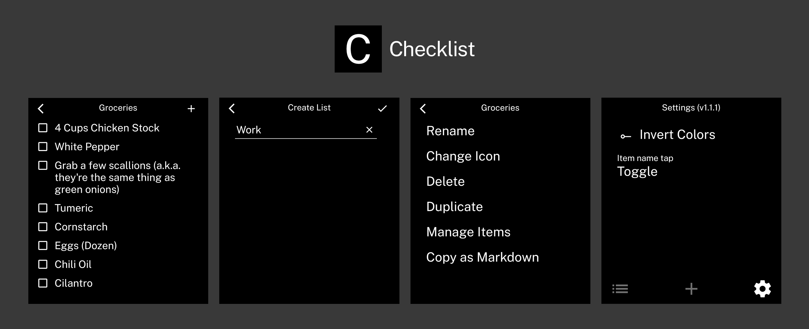

A simple checklist app with list-based organization for Light Phone/Luma users.

## Installation

The latest .apk file is available in [releases](https://github.com/ak-nattyb/Checklist/releases/latest).

I recommend using [Obtainium](https://github.com/ImranR98/Obtainium) and adding the repository's URL to receive updates.

## Features

- Press the header + to create a list
- Press on a list row to open a list
- Long press on a list row to rename, duplicate, copy as Markdown, or delete it
- Press on an open list's header title to rename it
- Inbox is always available and cannot be deleted
- Press the bottom + to add an item, then choose a list for it
- Create a new list from the add-to-list screen
- Press on an item icon to check/uncheck
- Press on an item title to rename it
- Checklist stores and persists between app loads/unloads and phone restarts
- Invert colors from Settings

## Acknowledgements

Huge thank you to the following projects:

- Vandamd's Light Template: [light-template](https://github.com/vandamd/light-template)

## Support

Send me (rustybeets) or Vandamd (Vandam) a message on the Light Phone discord if you run into any issues!

If you find this app useful and want more apps like it to exist, [consider sponsoring Vadamd](https://github.com/sponsors/vandamd)! :)
